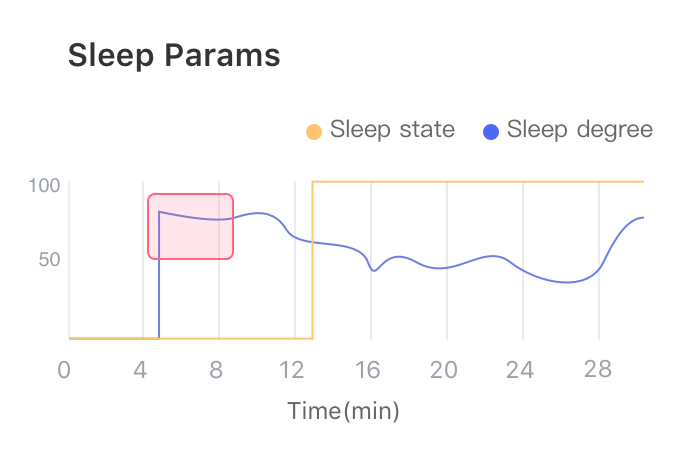
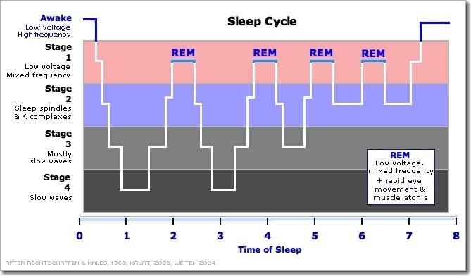

# 睡眠（Sleep）
## 名词解释
### 睡眠监测（Sleep）
大脑在不同睡眠阶段，前额脑电波的时域与频域特征也不同。清醒状态下 β 波能量较高，闭眼放松时 α 波能量会增加，进入浅睡状态后 θ 波能量较高，脑电波的波形复杂度也会下降，而在深睡状态下则会出现 δ波。睡眠监测模块基于多年积累的数据库中大量的睡眠数据，通过提取实时脑电波的时域与频域特征进行深度学习，结合丰富的数据模型，从而对睡眠状态进行监测。

> [!NOTE]
> 由于每个人的脑电频谱特征不同，睡眠监测模块会在体验的初始阶段采集基线来进行自适应，为了获得较好的体验，在体验开始的前1分钟可尽量减少面部活动（如眨眼、眼动、咬牙等）带来的干扰。另外，初始阶段采集基线的过程默认为清醒状态，若在初始阶段就入睡或在已入睡的情况下开始体验，则有可能对结果造成一定影响。

### 睡眠状态（Sleep State）
实时给出入睡判断，可用于控制睡眠环境中的某些设备（如关闭音乐、关闭灯光等）。

睡眠状态倾向于判断为清醒，以更大概率确保在使用者在入睡后再切换设备状态，因此睡眠状态的变化不一定反映入睡点，具体的入睡点将在综合报表中给出。

### 睡眠程度（Sleep Degree）
实时反映睡眠的深度，可用于实时观察使用者的睡眠情况。

由于实时计算的睡眠程度没有经过总体校正，因此在清醒、浅睡与深睡之间没有固定的界限划分，但睡眠程度的相对变化仍可用于实时反映使用者的睡眠状态倾向，值越大表明越接近清醒，值越小表明越接近深睡。

> [!NOTE]
> 某一时刻得到的睡眠程度值并不能简单通过阈值划分的方式来判断使用者是清醒、浅睡或深睡，但睡眠程度在一段时间内的变化趋势可以一定程度上反映使用者的状态变化情况。主要比较前后趋势来做实时的比较。

### 睡眠曲线（Sleep Curve）
在睡眠报表中，用一条曲线反映整个体验过程的睡眠情况。曲线值越高表明越接近清醒，曲线值越低表明越接近深睡。睡眠曲线经过了总体校正，能够更准确地反映整个体验过程中的睡眠情况。

睡眠状态的界限划分为：清醒——70~100（其中可进一步细分为：清醒——80~100；迷糊——70~80）；浅睡——30~70；深睡——0~30。

睡眠状态包括 REM 期（快速眼动期）与 NREM 期（非快速眼动期）两大类，其中 NREM 期可分为 N1~N4 期（R&K 标准，另 AASM 标准将 R&K 标准的 N3 期与 N4 期合并，[关于 R&K 和 AASM](https://www.ncbi.nlm.nih.gov/pmc/articles/PMC2635577/)），N1 与 N2 期对应浅睡眠，N3 与 N4 期对应深睡眠。REM 期一般表现为眼球快速运动，大多数情况下人们在 REM 期会做梦。由于 REM 期的脑电波特征与 N1 期较为相似，因此这一状态可能导致睡眠曲线中间出现一个高峰，峰值接近清醒值。

### 入睡点（Sleep Point）
通过完整的睡眠过程分析，在睡眠曲线上给出系统判定的入睡时刻（入睡点通过索引的方式给出，与睡眠曲线对应）。入睡点经过了更加完善的策略综合判定得到，能够更加接近真实的入睡时刻。若该次体验未入睡，则入睡点不会在睡眠曲线上标出。

 

### 时长统计（Duration）

时长统计包括：清醒时长、浅睡时长、深睡时长、入睡用时。

* 清醒时长（awake duration）：主要包括入睡前的清醒时段与醒来后的入睡时段，但由于夜间睡眠可能出现做梦的情况，在该状态下，前额脑电波的特征接近于清醒状态，因此清醒时长的统计有较小的可能包含少量中途做梦的时长。
* 浅睡时长（light duration）：统计得到睡眠过程中浅睡状态的时长。主要出现在小睡过程中和夜间睡眠中的大部分，充足的浅睡眠能够恢复精神，提高人体的免疫力。
* 深睡时长（deep duration）：统计得到睡眠过程中深睡状态的时长。在夜间睡眠中出现，一般占总时长的15%~25%，充足的深睡眠能够恢复体力，促进新陈代谢。
* 入睡用时（sleep latency）：根据入睡点计算得到的入睡所用时长。值越小表明入睡速度越快。

正常的小睡，一般只会进入浅睡眠，若小睡时间过长，有可能进入深睡眠，此时醒来会出现头晕、无力等现象。

正常的夜间睡眠，一般由浅睡眠与深睡眠交替，形成睡眠周期。在睡眠的前 3 小时深睡占比较大，之后睡眠以浅睡为主。
   

## 最佳实践

### 智能硬件的睡眠辅助

#### 睡眠状态（Sleep State）的应用

* 通过给出的入睡判断，自动停止助眠音乐。
* 通过睡眠状态（Sleep State）给出的入睡判断，自动关闭灯光。

#### 睡眠程度（Sleep Degree）的应用

* 根据睡眠程度实时谱曲，通过正反馈谱出的助眠曲，帮助用户快速入睡。(参见[易休](http://app.mi.com/details?id=cn.entertech.innerpeace)的主要功能)
* 通过睡眠程度调节灯光的亮度，营造最合适的睡眠环境。

