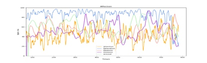
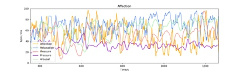

# 压力水平（Pressure）
## 名词解释
压力监测模块通过分析心率等指标来评价身体的压力水平。值越高表明压力越大，值越低表明压力越小。

> [!NOTE]
> 在饮酒、生病、睡眠不足等情况下，压力可能比正常状态高。运动可能会影响压力水平的测量。

> [!NOTE]
> 由于压力监测模块需要采集一些较长时间的生理指标，因此实时的压力水平可能需要较长时间（一般为1分钟以上）才能出现。

## 最佳实践
> [!TIP]
> 通过「最佳实践」，我们会提供一些我们已经实践过的应用场景供你参考，通过这些例子你可以了解如何将我们提供的数据和你的应用场景结合。

### 压力水平在冥想中的应用
冥想过程中，通过深呼吸训练可以有效减少压力，长期冥想训练可以改善压力水平。未经过长期训练的人，压力通过放松度指标可以反映冥想过程中的放松度变化趋势，一般在闭眼放松或进入冥想状态后，放松度会提高，经过放松训练可以提高放松度水平，使精神得到更快的恢复。

> [!TIP]
> 压力监测模块与放松度监测模块结合，能够更好地反映身体和精神两个层面的放松状态。
