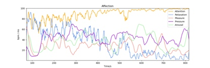

# 放松度（Relaxation）
## 名词解释
大脑在清醒放松时，前额脑电波的频谱会发生变化，α波能量会增加，放松度监测模块通过捕捉实时脑电波的频谱特征，结合积累的大量数据从而计算放松度，用于评价大脑的清醒放松程度。这种放松程度与身体感受到的放松感觉意义不同，主要反映精神层面的放松状态，较高的放松度表明大脑处于放松状态，但同时保持清醒，而较低的放松度则表明可能处于紧张或焦虑的精神状态。

> [!NOTE]
> 由于每个人的脑电频谱特征不同，注意力监测模块会在体验的初始阶段采集基线来进行自适应，为了获得较好的体验，在体验开始的前30秒可尽量减少面部活动（如眨眼、眼动、咬牙等）带来的干扰。

## 最佳实践
> [!TIP]
> 通过「最佳实践」，我们会提供一些我们已经实践过的应用场景供你参考，通过这些例子你可以了解如何将我们提供的数据和你的应用场景结合。

### 放松度在冥想场景下的应用
大多数形式的冥想都是大脑放松的过程。通过放松度指标可以反映冥想过程中的放松度变化趋势，一般在闭眼放松或进入冥想状态后，放松度会提高，经过放松训练可以提高放松度水平，使精神得到更快的恢复。

**注意力与放松度（Attention & Relaxation）**

注意力监测模块与放松度监测模块结合能够更好地反映冥想的状态。

对于未经过长期冥想训练的人，特定状态下的脑电波频谱较为集中，在专注状态下放松度一般不高，而在放松状态下注意力一般较低，两者呈现出“互斥”的现象；而经过长期冥想训练的人，脑电波频谱分布更广阔而均匀，可以在大脑清醒放松的同时保持专注和觉醒的状态，在冥想过程中注意力和放松度均能维持在较高水平。这种状态下，由于大脑放松而专注，更容易迸发灵感，创造力较强。
 

 
经过长期训练的冥想注意力与放松度（黄线与蓝线，进入状态前可能此高彼低或者都不高，进入冥想状态后两者都维持高水平）
