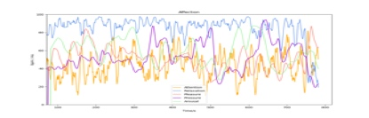

# 注意力（Attention）

## 名词解释
大脑在专注时，前额脑电波的频谱会发生变化，β 波能量会增加，注意力监测模块通过捕捉实时脑电波的频谱特征，结合积累的大量数据从而计算注意力，用于评价专注程度。值越高表明越专注，大脑越活跃。

> [!NOTE]
> 由于每个人的脑电频谱特征不同，注意力监测模块会在体验的初始阶段采集基线来进行自适应，为了获得较好的体验，在体验开始的前30秒可尽量减少面部活动（如眨眼、眼动、咬牙等）带来的干扰。

## 最佳实践
> [!TIP]
> 通过「最佳实践」，我们会提供一些我们已经实践过的应用场景供你参考，通过这些例子你可以了解如何将我们提供的数据和你的应用场景结合。

### 注意力在冥想应用场景下的应用
大多数形式的冥想需要控制注意力，比如关注自己的呼吸，如果发现自己走神，需要把注意力唤回，重新保持对呼吸的关注，或者目不转睛盯住一个物体，控制自己的注意力。通过注意力指标可以反映冥想过程中的注意力变化趋势。

没有经过长期训练的人注意力难以在高水平维持较高时间，一般表现为忽高忽低，经过长期训练的人士可以将注意力维持在很高水平。

坚持长期的冥想练习，可使注意力总体水平和专注状态的持久度都得到提高。

### 儿童专注力训练
（待补充）
